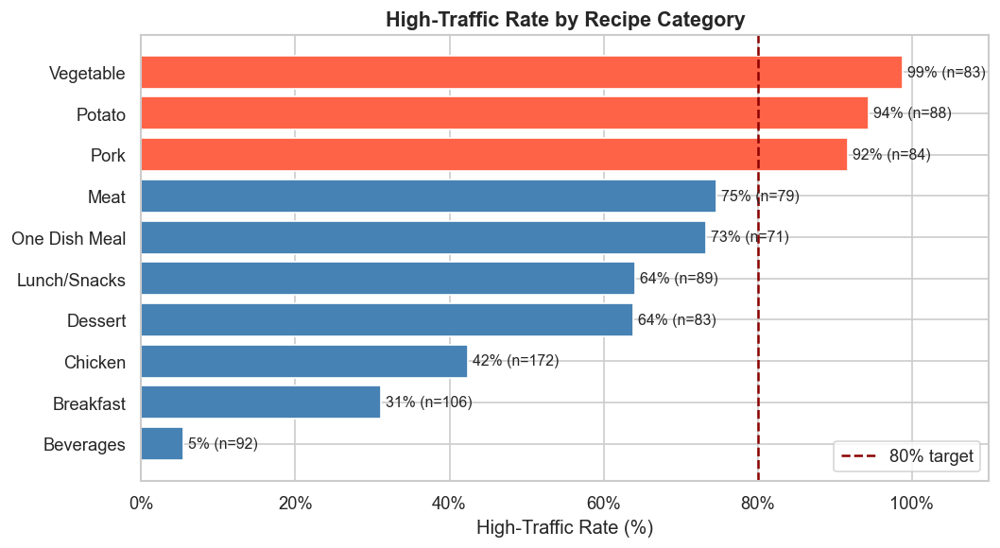
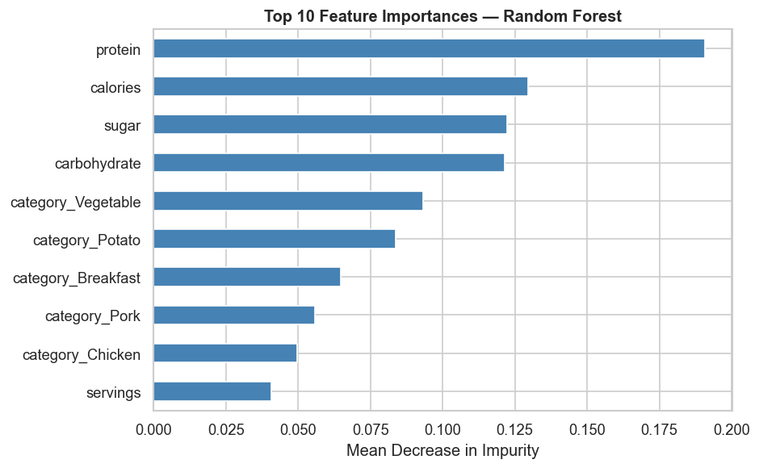
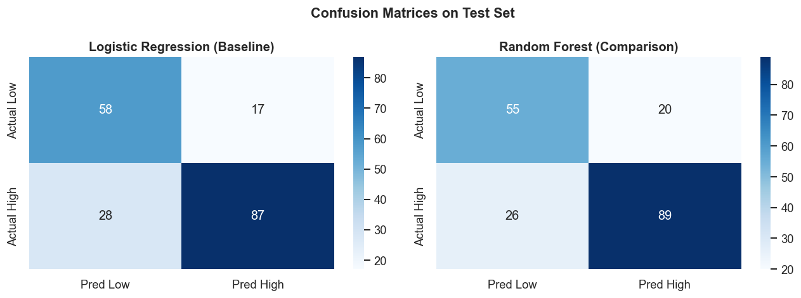
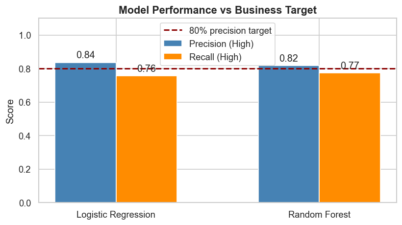

# DataCamp Data Science Certifications

**Florian Braun** · DataCamp certified Data Scientist

[](https://www.python.org/)
[](https://scikit-learn.org/)
[](https://jupyter.org/)
[](LICENSE)

This repository contains the practical exam submissions for two DataCamp data science certifications.

---

## Certifications

### [Data Scientist Associate](associate/) — RealAgents House Price Prediction

> **Business problem:** RealAgents wants to optimise listing prices to reduce time-to-sale. Given historical sale records, predict the sale price of a house.

**Task type:** Regression  
**Models:** Linear Regression (baseline) · Random Forest Regressor (comparison)

| Task | Description |
|---|---|
| Task 1 | Identify missing values in the `city` column |
| Task 2 | Clean and validate all columns per the data dictionary |
| Task 3 | Analyse average sale price by number of bedrooms |
| Task 4 | Baseline model — Linear Regression on numeric features |
| Task 5 | Comparison model — Random Forest with categorical encoding |

---

### [Data Scientist Professional](professional/) — Tasty Bytes Recipe Traffic Prediction

> **Business problem:** Tasty Bytes wants to feature recipes on their homepage that drive traffic and subscriptions. Predict which recipes will generate high traffic, with at least 80% precision.

**Task type:** Binary classification  
**Models:** Logistic Regression (baseline) · Random Forest Classifier (comparison)

| Metric | Logistic Regression | Random Forest |
|---|---|---|
| Precision (High) | 83.7% | **81.7%** |
| Recall (High) | 75.7% | 77.4% |
| F1 (High) | 79.5% | 79.5% |
| Accuracy | 76.3% | 75.8% |

Both models beat the 80% precision target. Random Forest is recommended for deployment.

**Key findings:**
- Recipe **category** is the strongest predictor — Potato (87%), Pork (76%), Vegetable (72%) generate the most traffic
- Nutritional content (especially calories and protein) adds incremental signal
- The naive baseline of always predicting High only achieves 60.6% precision

**Visualisations:**

| | |
|---|---|
|  |  |
|  |  |

---

## Repository Structure

```
├── README.md
├── LICENSE
├── requirements.txt
├── .gitignore
│
├── associate/                          # DS Associate — house price regression
│   ├── notebook.ipynb
│   └── data/
│       ├── house_sales.csv
│       ├── train.csv
│       └── validation.csv
│
└── professional/                       # DS Professional — recipe traffic classification
    ├── notebook.ipynb
    ├── presentation_script.md
    ├── data/
    │   └── recipe_site_traffic_2212.csv
    ├── figures/
    │   ├── plot_business_metrics.png
    │   ├── plot_calorie_distribution.png
    │   ├── plot_category_distribution.png
    │   ├── plot_confusion_matrices.png
    │   ├── plot_feature_importance.png
    │   ├── plot_nutrition_vs_traffic.png
    │   └── plot_traffic_by_category.png
    └── docs/
        └── exam_brief.pdf
```

---

## Setup

```bash
git clone https://github.com/hackathon-portfolio/Data-Scientist-DataCamp.git
cd Data-Scientist-DataCamp
pip install -r requirements.txt

# Run either notebook
jupyter notebook associate/notebook.ipynb
jupyter notebook professional/notebook.ipynb
```

---

## License

[MIT](LICENSE) © 2025 Florian Braun
